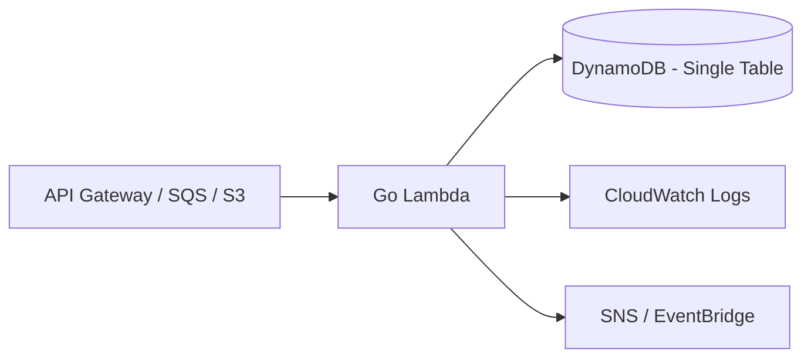

# AWS Lambda + DynamoDB (Golang)

[](https://opensource.org/licenses/MIT)
[](https://aws.github.io/aws-sdk-go-v2/docs/getting-started/)

A production-grade template for building highly scalable, cost-optimized serverless applications on AWS using Golang. Focuses on **Single-Table Design** and **Event-Driven Architecture**.

---

## // SYSTEM_WORKFLOW



---

## // ARCHITECTURAL_PILLARS
- **Compute:** Go 1.23+ Lambda functions optimized for low cold-start latency using small binaries and efficient global state management.
- **Persistence:** DynamoDB Single-Table Design with carefully modeled GSIs (Global Secondary Indexes) for complex access patterns.
- **Infrastructure:** Fully automated via **Terraform** — the industry standard for multi-account AWS state management and resource provisioning.
- **Resilience:** SQS Dead-Letter Queues (DLQs) for reliable event processing and Lambda destination configuration.

---

## // DYNAMODB_ACCESS_PATTERNS
| Data Entity | Primary Key (PK) | Sort Key (SK) | GSI_1_PK |
|:--- |:--- |:--- |:--- |
| **USER** | `USER#[ID]` | `METADATA` | `EMAIL#[EMAIL]` |
| **ORDER** | `USER#[ID]` | `ORDER#[ID]` | `STATUS#[STATUS]` |
| **PRODUCT** | `PRODUCT#[ID]` | `METADATA` | `CATEGORY#[CAT]` |

---

## // PERFORMANCE_TUNING
1. **Cold Starts:** Using Lambda `provided.al2023` runtime with Go binary size optimization.
2. **Connection Pooling:** Initializing AWS SDK v2 clients outside the Lambda handler to reuse TCP connections across subsequent invocations.
3. **Provisioned Concurrency:** Strategic use for high-traffic endpoints to eliminate latency spikes.

---

## // SYSTEM_STRUCTURE
```zsh
.
├── functions/          # Lambda function handlers
├── pkg/
│   ├── adapters/       # DynamoDB, SNS, DTO logic
│   └── domain/         # Pure business logic (Hexagonal Lite)
├── infra/              # Terraform definitions
└── scripts/            # Build (GOOS=linux) and deployment
```

---

## // LOCAL_UPLINK
```zsh
# 1. Build binary
GOOS=linux GOARCH=amd64 go build -o bootstrap ./functions/main.go

# 2. Local invoke with SAM
sam local invoke "MyFunction" -e events/sample.json

# 3. Deploy
terraform apply
```

---

```zsh
> STATUS: STUB_INITIALIZED
> TODO: Implement the Primary Access Pattern for Order creation.
```
