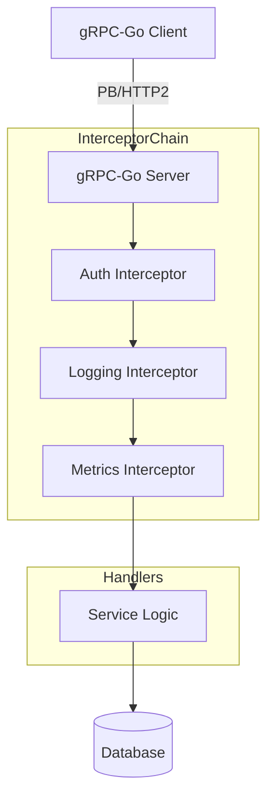

# gRPC Go Patterns

[](https://opensource.org/licenses/MIT)
[](https://grpc.io/docs/languages/go/)

A curated collection of production-grade architectural patterns for building high-performance, type-safe gRPC services in Golang. 

---

## // INTERCEPTOR_PIPELINE



---

## // IMPLEMENTED_PATTERNS
- **Middleware Chain:** Unary and Stream interceptors for universal authentication, structured logging (zerolog), and Prometheus instrumentation.
- **Error Propagation:** Detailed error modeling using `google.golang.org/genproto/googleapis/rpc/errdetails` to provide rich context to clients.
- **Client Resilience:** Client-side load balancing, retries with jitter, and deadline propagation.
- **Streaming:** Implementations for Server-side, Client-side, and Bidirectional streaming RPCs.

---

## // ADVANCED_ERROR_MODEL
Instead of plain strings, this project utilizes a structured error model:
```go
// Example of internal error mapping
st := status.New(codes.InvalidArgument, "invalid request")
br := &errdetails.BadRequest{
    FieldViolations: []*errdetails.BadRequest_FieldViolation{
        {
            Field:       "user_id",
            Description: "must be a valid UUID",
        },
    },
}
st, _ = st.WithDetails(br)
return st.Err()
```

---

## // SYSTEM_STRUCTURE
```zsh
.
├── proto/              # Highly structured .proto definitions
├── gen/                # Auto-generated Go code (protoc-gen-go)
├── internal/
│   ├── server/         # Server implementation and interceptors
│   └── client/         # Resilient client wrappers
└── cmd/                # Entry points
```

---

## // LOCAL_UPLINK
```zsh
# 1. Generate code from proto
./scripts/generate.sh

# 2. Run the server
go run cmd/server/main.go

# 3. Test with Evans CLI
evans --port 50051 -r repl
```

---

```zsh
> STATUS: STUB_INITIALIZED
> TODO: Define Protobuf contracts for the primary service.
```
