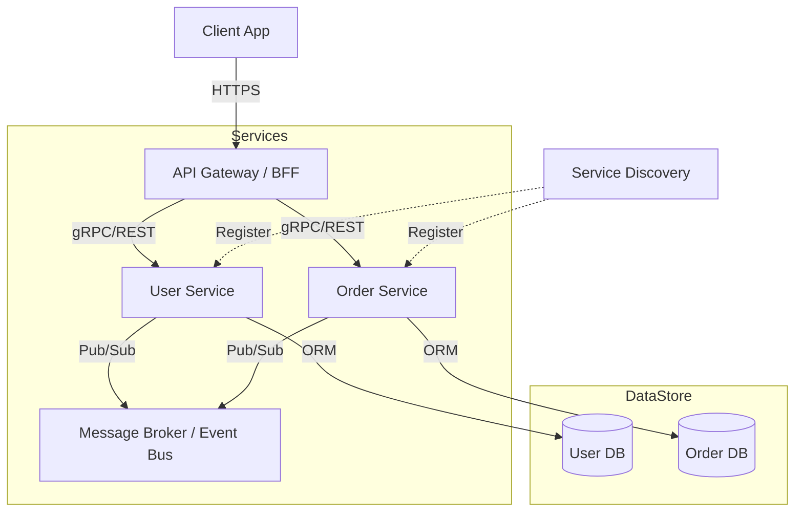

# Microservices Demo (Golang)

[](https://opensource.org/licenses/MIT)
[](https://golang.org/doc/devel/release.html)

A high-performance, resilient microservices ecosystem demonstrating modern backend orchestration patterns in Go. This repository serves as a blueprint for scalable, cloud-native distributed systems.

---

## // ARCHITECTURE_OVERVIEW



---

## // CORE_PATTERNS
- **Resilience:** Circuit Breakers (Hystrix/Resilience4j style), Exponential Backoff Retries, and Bulkheads.
- **Service Discovery:** Consul integration for dynamic service registration and health checking.
- **Observability:** Distributed tracing with OpenTelemetry (Jaeger) and metrics via Prometheus/Grafana.
- **Communication:** Synchronous gRPC for internal service-to-service calls; Asynchronous messaging using an abstract **Event Bus** layer supporting NATS, Kafka, or SQS depending on deployment requirements.

---

## // ENGINEERING_TRADEOFFS
| Feature | Choice | Rationale |
|:--- |:--- |:--- |
| **Transport** | gRPC | Superior performance over REST for internal communication; strictly typed contracts. |
| **Messaging** | NATS JetStream | Lower operational complexity than Kafka for this scale; built-in persistence and horizontal scale. |
| **Database** | PostgreSQL | Robust ACID compliance for order processing; extensible with JSONB for flexible user profiles. |

---

## // SYSTEM_STRUCTURE
```zsh
.
├── cmd/                # Entry points for each service
├── internal/           # Private application and library code
├── pkg/                # Public library code (integrations, utilities)
├── proto/              # Protocol Buffer definitions
├── infra/              # Infrastructure-as-Code (Kubernetes, Helm)
└── scripts/            # Build and deployment automation
```

---

## // LOCAL_UPLINK
```zsh
# 1. Start the environment
docker-compose up -d

# 2. Deploy to local K8s
helm install . ./infra/k8s

# 3. Verify health
curl http://localhost:8080/health
```

---

```zsh
> STATUS: STUB_INITIALIZED
> TODO: Implement Order Service logic and persistence layer.
```
