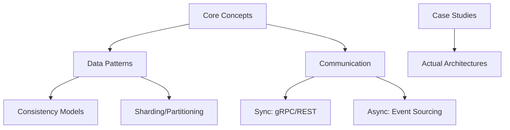

# System Design & Architecture Notes

[](https://opensource.org/licenses/MIT)
[](https://deepanshu102.github.io)

A collection of **Architectural Decision Records (ADRs)**, scalability case studies, and deep-dives into distributed system design patterns. This repository documents the "Why" behind complex technical choices.

---

## // KNOWLEDGE_HIERARCHY



---

## // ARCHITECTURAL_DECISION_RECORDS_(ADR)
Professional engineering involves structured decision making. Every major architectural choice should be documented as an ADR:
- **Case Study Highlight:** *Transitioning from Microservices to Macro-services at Kairos Technologies.* A detailed breakdown of why we pivoted, the operational costs of fine-grained services, and the gains in reliability and developer velocity.
- **Decision:** What is the chosen path?
- **Rationale:** Why this path over others? (Cost, Complexity, Scalability).
- **Consequences:** What are the trade-offs (positive or negative) of this choice?

---

## // FAILURE_MODE_ANALYSIS
Every design includes a "How it Breaks" section covering:
- **Single Points of Failure (SPOF):** Identifying and mitigating them.
- **Cascading Failures:** Implementing circuit breakers and rate limits to prevent site-wide outages.
- **Data Integrity:** Handling partial failures in distributed transactions (Saga pattern vs Two-Phase Commit).

---

## // CORE_TOPICS
| Category | Topic | Focus |
|:--- |:--- |:--- |
| **Databases** | **Polyglot Persistence** | When to use SQL vs NoSQL vs Graph. |
| **Cache** | **Invalidation Strategies** | Write-through, Write-around, and TTL management. |
| **Networking** | **Load Balancing** | L4 vs L7 balancing and health check strategies. |
| **Security** | **Zero Trust** | Identity-based access and mTLS in microservices. |

---

## // REPOSITORY_STRUCTURE
```zsh
.
├── ADR/                # Formal Architectural Decision Records
├── case-studies/       # Deep dives into real-world scaling problems
├── concepts/           # Fundamentals (CAP theorem, PACELC, etc.)
└── whitepapers/        # Long-form architectural analysis
```

---

```zsh
> STATUS: STUB_INITIALIZED
> TODO: Document the ADR for "Moving from Microservices to Macro-services".
```
